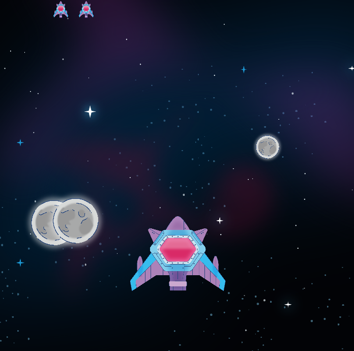
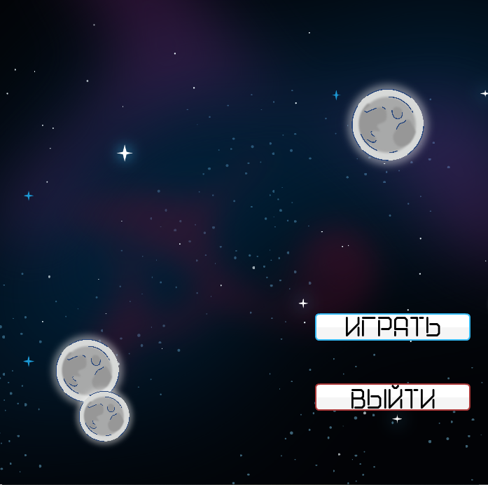

# Космический Шутер на PyGame

 
 *скриншоты*

## Описание
Простой 2D-шутер с космическим кораблём, метеоритами и лазерами. Игрок управляет кораблём, уворачивается от метеоритов и стреляет по ним.

## Особенности
- Система здоровья корабля (3 жизни)
- Генерация случайных метеоритов разных размеров
- Звуковые эффекты
- Фоновая музыка
- Меню с кнопками "Играть" и "Выйти"

## Управление
- **Стрелки** ← → для перемещения корабля
- **Пробел** или **ЛКМ** для стрельбы
- **Кнопки в меню** - взаимодействие с интерфейсом

## Требования
- Python 3.x
- PyGame (`pip install pygame`)

## Структура проекта
- main.py - основной игровой цикл
- settings.py - настройки игры (размеры окна и др.)
- sprites.py - классы объектов (корабль, метеориты, лазеры)
- /pictures/ - графика и звуки
